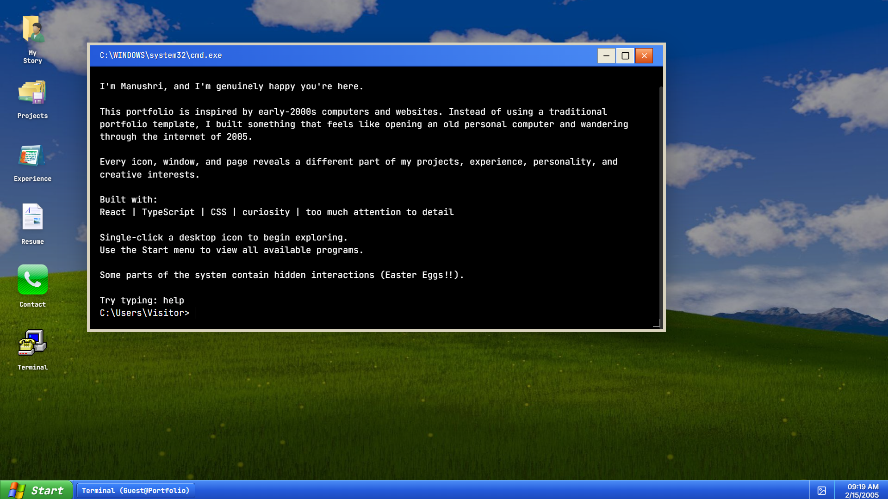
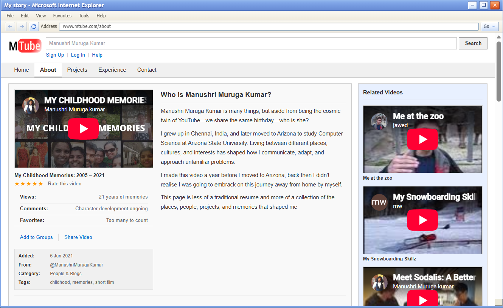
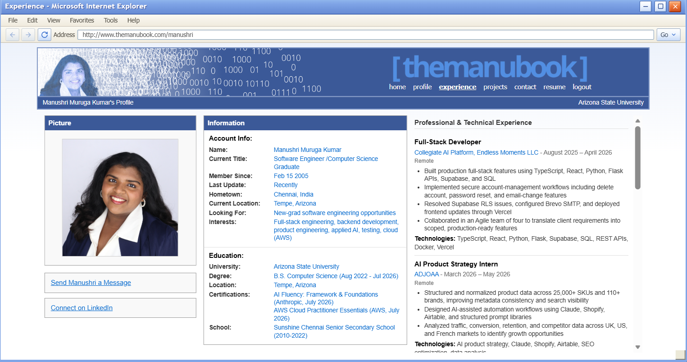
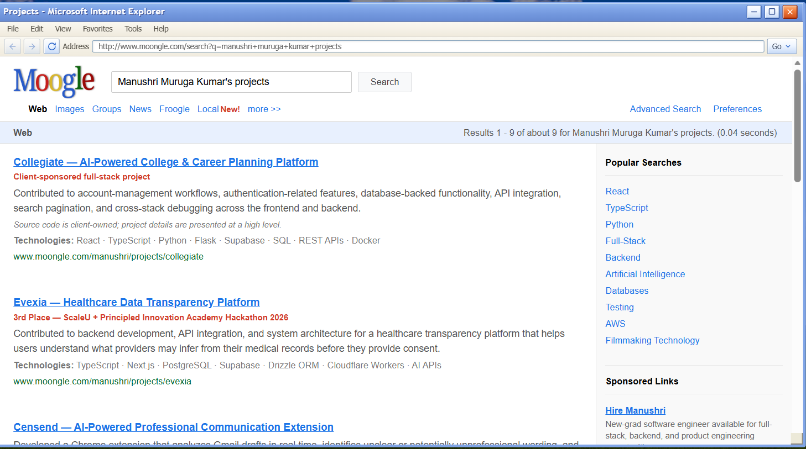
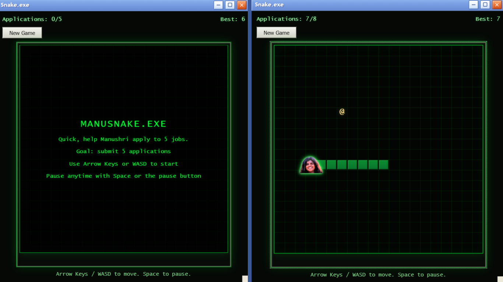

# Mindows 2005

Mindows 2005 is an interactive portfolio built as a Windows XP-inspired desktop experience. Instead of a standard landing page, the app opens with a boot screen, drops visitors onto a nostalgic desktop, and lets them explore Manushri's story through draggable windows, retro web parodies, terminal commands, and a mini-game.

## Current App Snapshot

As of July 18, 2026, the app currently includes:

- 1 animated boot sequence
- 6 desktop icons: My Story, Projects, Experience, Resume, Contact, and Terminal
- 4 browser-style portfolio pages: MTube, Moogle, themanubook, and ManuPress
- 9 project entries in the Moogle projects experience
- 7 experience entries across 3 experience categories
- 10 built-in terminal commands: `help`, `whoami`, `about-os`, `tech`, `credits`, `cat`, `fortune`, `clear`, `reboot`, and `play`
- 1 Snake mini-game with keyboard and touch controls
- Custom wallpaper upload with local persistence
- Responsive desktop and window behavior for desktop, tablet, and phone layouts

## What The App Does

- Simulates a retro desktop with a taskbar, Start menu, movable desktop icons, and layered windows
- Presents the About page as a video-platform parody with image lightboxes and related content
- Presents projects as a search-engine parody with filtering, highlighted work, and sponsored links
- Presents experience as a social-profile parody with structured experience, education, and resume links
- Presents contact info in a publisher-style page with external links and a work-in-progress contact form
- Includes a terminal-first intro so visitors can explore the portfolio through commands as well as UI navigation

## Screenshots

<table>
  <tr>
    <td></td>
    <td></td>
  </tr>
  <tr>
    <td></td>
    <td></td>
  </tr>
  <tr>
    <td colspan="2"></td>
  </tr>
</table>

## Stack

- React 18
- TypeScript
- Vite
- React Router
- Tailwind CSS
- Custom CSS for the retro UI themes and page-specific styling

## Local Development

### Prerequisites

- Node.js 18+
- npm

### Run The App

```bash
npm install
npm run dev
```

The development server runs on `http://localhost:8080`.

### Production Build

```bash
npm run build
```

The app is configured for GitHub Pages deployment, and the Vite base path is set to `/manus/`.

## Project Notes

- The contact form UI is present, but submission is not wired to a backend yet.
- The resume opens from a bundled PDF in `public/assets/icons/M-photos/`.
- The Snake game stores its best score in local storage.
- The wallpaper picker also stores the selected wallpaper in local storage.

## Credit

This project was originally inspired by the `tfish` portfolio concept and has since been heavily customized into the current Mindows 2005 experience.
